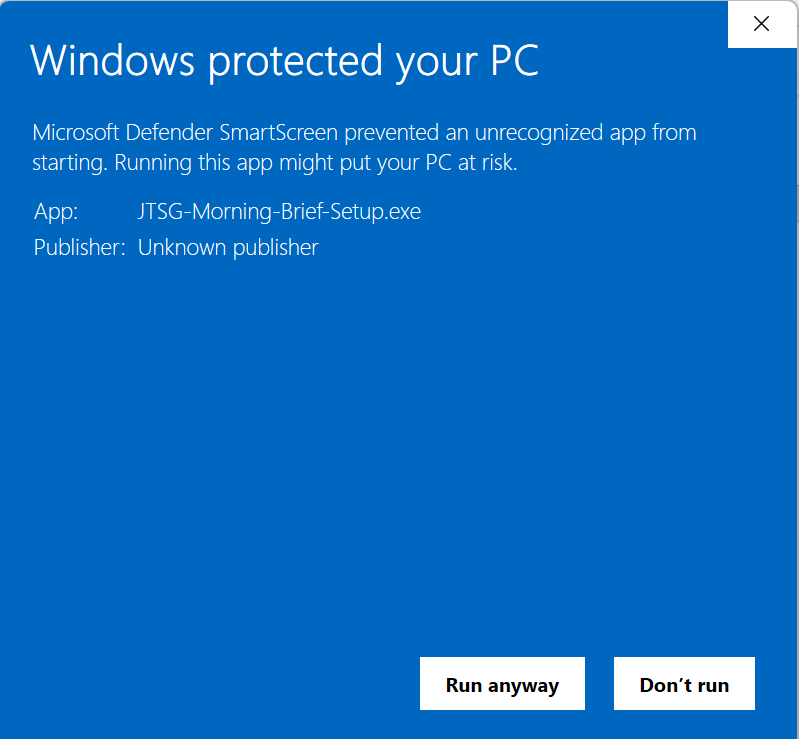

# JTSG Morning Brief: installing it on your computer

One installer, one sign-in, and the brief arrives every morning on its own.
You need: Windows 10 or 11 (64-bit), an internet connection, the firm's Claude
account (Pro or Max), and the access key we sent you separately.

## 1. Download

Open this link and save the file:
https://github.com/Udayaaji/jtsg-morning-brief-setup/releases/latest/download/JTSG-Morning-Brief-Setup.exe

## 2. Run it, and get past the Windows warning

Double-click the file. Windows shows "Windows protected your PC" because the
installer is not code-signed. Click **More info**, then **Run anyway**.

## 3. Answer two questions

- **Access key:** paste the key we sent you. The installer checks it before
  continuing. If it says the key was not accepted, look for a missing
  character at either end.
- **Delivery folder:** where each morning's brief is saved. The default is
  `Documents\JTSG Morning Brief`. Choose a folder whose name uses English
  letters only.

## 4. Wait for setup (2 to 5 minutes)

A black window shows progress: a private copy of Python and the Morning Brief
pipeline are downloaded into one folder under your user profile, and Claude
Code is installed under your user profile as well. Nothing outside your user
profile is changed and no administrator password is needed.

## 5. Sign in to Claude

At the end, a browser window opens. Sign in with the firm's Claude account.
This single sign-in IS the connection: it is stored on this computer and every
morning's run uses it. The cost of generating the brief sits on the firm's
Claude subscription; nothing is billed by us.

If a later notification says "Sign in to continue", it means the stored
sign-in has expired. Open Start Menu, JTSG Morning Brief, **Sign in to Claude**
and sign in again. That is routine, not a fault.

## What happens every morning

The brief is generated Monday to Saturday at 06:40, or as soon as you open the
laptop and sign in to Windows after that. It takes 10 to 30 minutes. Keep the
lid open; the computer will not sleep while it works.

A notification appears when it is done:
- **Morning Brief ready for review**: click it to open the delivery folder.
  Review the PDF before circulating it.
- **Morning Brief not produced today**: open `Morning_Brief_Status_<date>.md`
  in the delivery folder. The first lines say what happened and what to do.
  If it asks you to forward the file, send it to us.
- **Sign in to continue**: see section 5.

The delivery folder receives four files a day: the PDF, a social pack, the
list of sources, and the status report. You can move or delete them freely.

## Start Menu shortcuts

Under JTSG Morning Brief: **Sign in to Claude**, **Run Morning Brief now**,
**Morning Brief schedule** (pause, resume or retime the morning run), and
**Morning Brief folder**.

## The first two weeks

The first run starts with no history, so the brief's repetition check and
day-to-day market continuity check are quiet until a few days have
accumulated. Market figures are still checked against the live market feed
from day one.

## Removing it

Settings, Apps, JTSG Morning Brief, Uninstall. The delivery folder and your
briefs are left in place. Claude Code itself stays installed too; remove it
separately if you want it gone.
